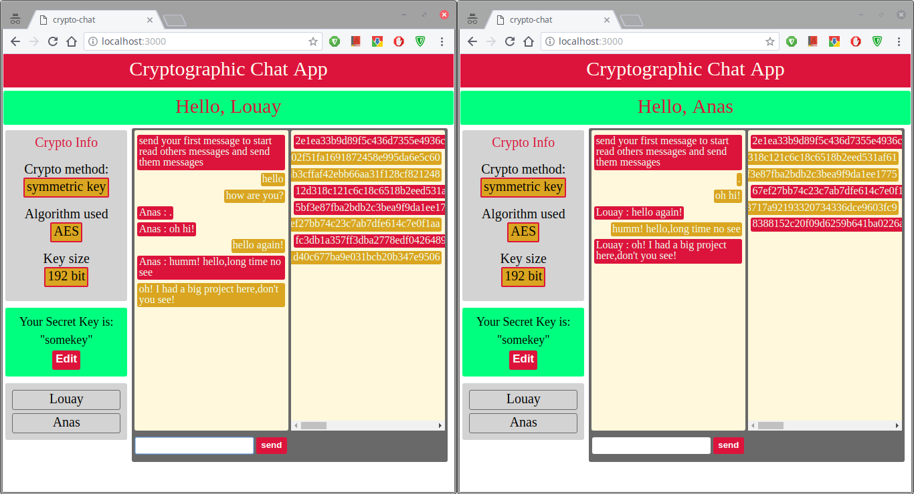
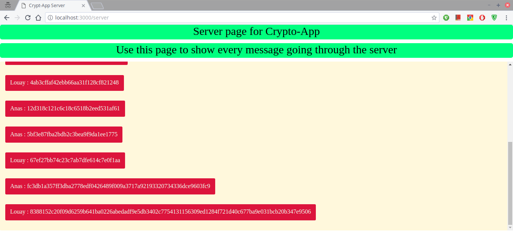

# crypto-chat
Cryptographic chat web app made for college @Damascus University-subject:Information System Security.

Information System Security
Cryptography project 1
Damascus University

الأسم: محمد لؤي العش

الإختصاص: شبكات و نظم تشغيل

توصيف المشروع/project description:

code:

https://github.com/lalosh/crypto-chat

idea: 

make a Real time chat website to encrypt messages on clinet side then send the ecrypted messages on real time through the server to every connected client,so you can say it's a public chat server.

cryptography: 

used the build into nodejs module 'crypto' with algorithm "AES" with key size of "192-bit".

libraries/platforms used:

nodejs,expressjs,jQuery

important modules used:

browserify,nodemon,socket.io

implemention:

the app only has two pages:client,server .. yet you can open the website many times which initiate many clients(public clients) which can talk with each other saftley.
server page is used to display what is going through the server.

secret key policy:

you cannot send client a secret key,you should have been agreed upon some key and use it to speech to each other while no one else can decrypt your messages.

soon future:

File upload will be added really soon,and private chatting plus using the server setting page to change algorithm used,and finally make a better code organizing and module it as much as possible.

extra build:

RC4 module build in pure javascript by me at:
https://github.com/lalosh/RC4-Cryptography-module

How to run?

> git clone https://github.com/lalosh/crypto-chat.git

> cd crypto-app

> npm install

> browserify ./public/javascripts/_cryptoApp.js -o ./public/javascripts/cryptoApp.js

> npm start

this is an example of two users chatting

this is the server page where you can only read encrypted messages

