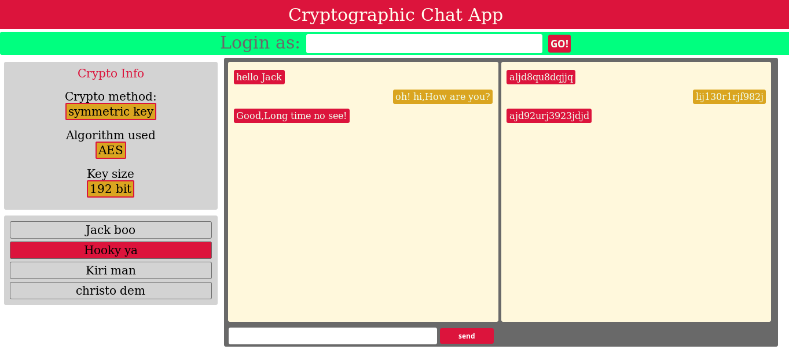

# crypto-chat
Cryptographic chat web app made for college @Damascus University-subject:Information System Security.

How to run?

git clone https://github.com/lalosh/crypto-chat.git
cd crypto-app
npm install
browserify ./public/javascripts/_cryptoApp.js -o ./public/javascripts/cryptoApp.js
npm start
